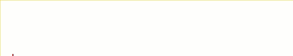
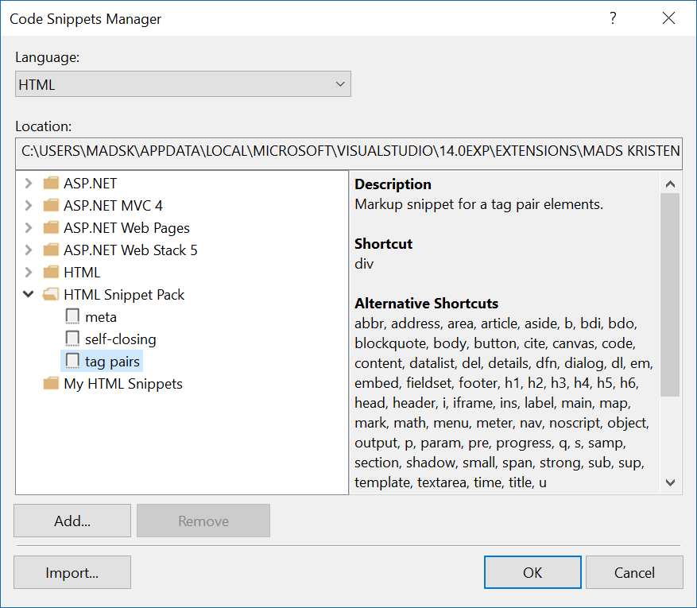

## HTML Snippet Pack for Visual Studio

Download this extension from the
[VS Gallery](https://visualstudiogallery.msdn.microsoft.com/7f30a50b-8211-40cf-b881-bd1eb2866478)
or get the
[nightly build](http://vsixgallery.com/extension/2a20580c-7be4-4440-bcd6-8dcf5aa2004e/).

-----------------------------------------

A snippet pack to make you more productive working with HTML.

This extension ships a bunch of useful code snippets for
the JavaScript editor. Get an overview from the
**Code Snippet Manager** in Visual Studio located under
the **Tools** top level menu.

Here's the full list of all the snippets:

## Contribute
Check out the [contribution guidelines](.github/CONTRIBUTING.md)
if you want to contribute to this project.

For cloning and building this project yourself, make sure
to install the
[Extensibility Tools 2015](https://visualstudiogallery.msdn.microsoft.com/ab39a092-1343-46e2-b0f1-6a3f91155aa6)
extension for Visual Studio which enables some features
used by this project.

## License
[Apache 2.0](LICENSE)